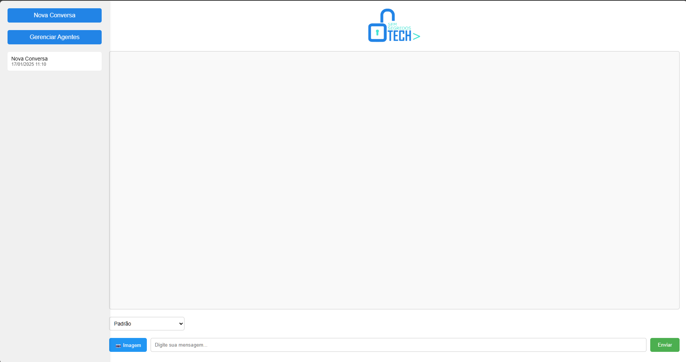

<div align="center">
<h1><b>Sem Segredos Bot<b></h1>
<h3> Um chatbot interativo usando a API Gemini do Google. </h3>  

---

<div style="text-align: center; font-size: 1.5em;">
  <h3> Junte-se ao nosso servidor Discord! </h3>
  <a href="https://discord.gg/u6uaWKC5qh">
    
  </a>
</div>
</div>

<br/>

<h2>Funcionalidades</h2>

<h3>
   
- [X] Chat interativo com o modelo Gemini gratuito
- [X] Suporte a criação de diferentes personalidades
- [X] Sistema de histórico de conversas
- [X] Interface web amigável
- [X] Interpretação de imagens

</h3>

  </div>
  </p>
  
</div>

<br/>

## Configuração

### 1. Abra o terminal do Windows e siga os passos abaixo:

### 2. Clone o repositório:
```bash
git clone https://github.com/diogopzlopes/sem_segredos_bot.git
cd sem_segredos_bot
```

### 3. Crie e ative um ambiente virtual:
```bash
python -m venv venv
```

- ### Para ativar no Windows:
```bash
venv\Scripts\activate
```

### 4. Instale as dependências:
```bash
pip install -r requirements.txt
```

### 5. Pegue sua chave api em https://aistudio.google.com/app/apikey
```bash
Crie e copie sua chave api (modelo usado no projeto é gratuito)
```

### 6. Renomear o arquivo .env.example para .env - Botão direito, editar com bloco de notas, adicione sua chave api e salve:
```bash
GEMINI_API_KEY=sua_api_key_aqui
```

### 7. Execute a aplicação - No terminal digite:
```bash
python app.py
```

### 8. Acesse o bot no navegador:
```bash
http://localhost:5000
```
